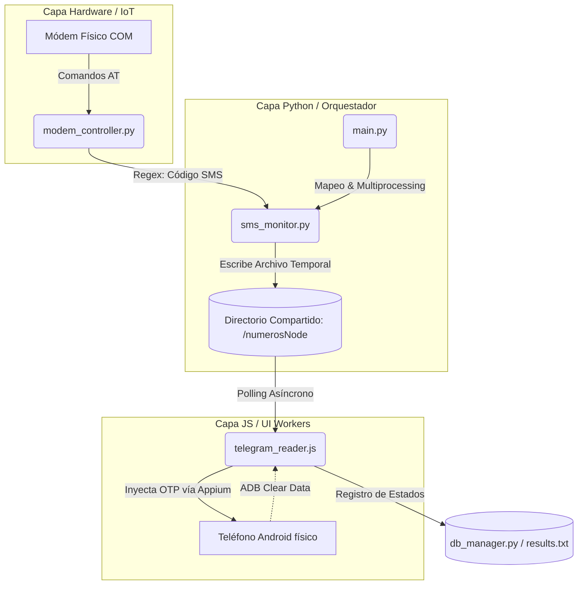

## <h1 align="center">📱 HIL-Telegram-Farm</h1>

<p align="center">
<b>Arquitectura de Automatización Distribuida (Hardware-in-the-Loop)</b>

<i aling="center">Orquestación paralela de módems IoT y nodos Android físicos mediante IPC y Appium.</i>

</p>

<p align="center">


</p>

## 📌 Resumen Ejecutivo

HIL-Telegram-Farm es un sistema distribuido de automatización avanzada diseñado bajo el paradigma HIL (Hardware-in-the-Loop). Su objetivo es orquestar de forma masiva y paralela una granja física de teléfonos Android y módems GSM/LTE, interactuando simultáneamente con componentes de hardware (puertos COM) y software de interfaz de usuario (UI).

El sistema automatiza flujos complejos de verificación y aprovisionamiento (detección de bloqueos SIM, validación de 2FA, suspensiones), leyendo puertos Seriales en tiempo real y delegando las tareas de navegación móvil a workers asíncronos distribuidos.

> **Disclaimer:** ⚠️ Aviso Legal: Este proyecto es un caso de estudio de ingeniería inversa, automatización y arquitecturas distribuidas. Desarrollado con fines de investigación en metodologías de Quality Assurance (QA) y Red Teaming.

---

### ⚙️ Arquitectura del Sistema

El proyecto resuelve el problema clásico de los cuellos de botella en operaciones de Entrada/Salida (I/O) de hardware, utilizando un enfoque de separación de responsabilidades y comunicación entre procesos (IPC - Inter-Process Communication):

1. Capa IoT (Control Físico)

Scripts en Python (modem_controller.py) gestionan conexiones Seriales directamente con el hardware. Envían comandos AT (ej. AT+CMGL="ALL") a múltiples módems físicos para extraer números MSISDN, leer ICCID y escuchar la llegada de SMS (Códigos OTP).

2. Capa Orquestadora (Master)

El script main.py mapea dinámicamente los recursos de red (Módems) con los nodos de cómputo (Teléfonos vía ADB). Utilizando la librería multiprocessing de Python, levanta procesos paralelos aislados, garantizando escalabilidad horizontal sin bloqueos de hilo principal (GIL).

3. Capa de Workers UI (Nodos)

Cada teléfono actúa como un nodo independiente controlado por un worker de Node.js (telegram_reader.js) a través de WebDriverIO y Appium. Los workers realizan rutinas de saneamiento vía ADB (limpieza de caché/datos), navegan por la app destino y gestionan tiempos de espera implícitos.

4. Capa IPC (Sincronización Asíncrona)

El demonio de Python (sms_monitor.py) extrae los códigos OTP entrantes mediante Regex y los escribe en archivos de texto temporales. Los workers de Node.js realizan passive polling sobre estos archivos, logrando inyectar el código en la UI en milisegundos tras su recepción en el hardware.

---

## 🚀 Flujo de Trabajo (Diagrama de Topología)


---

## ✨ Características Técnicas Destacadas

🧹 Auto-Sanitización de Puertos: El módulo servidorFarm.py detecta procesos zombi a nivel de sistema operativo y limpia los puertos ocupados antes de desplegar el clúster de servidores Appium, garantizando un arranque limpio.

📈 Escalabilidad Horizontal: Cada dupla (Dispositivo - Módem) se levanta en un subproceso propio con un puerto Appium dedicado (4723, 4724, etc.). El límite de procesamiento paralelo depende únicamente de la capacidad del bus USB del servidor Host.

🛡️ Tolerancia a Fallos HIL: Implementación de bucles de reintento (retries) para la navegación UI y captura de excepciones para fallos de conexión ADB/Serial, comunes en entornos de hardware real.

---

## 📋 Requisitos del Entorno (Despliegue Físico)

Al ser una arquitectura acoplada a hardware, se asume la siguiente topología de despliegue:

Software Base

Python 3.10+ (Orquestación y Serial)

Node.js v16+ (Workers UI)

Appium Server instalado globalmente (npm install -g appium)

Android Platform Tools (adb configurado en el PATH del sistema)

Hardware Mínimo

Servidor Host o Hub USB multi-puerto (preferiblemente con alimentación de red propia).

Módems USB (ej. Quectel, SIM800L, Huawei) accesibles vía puertos COM.

Nodos Android físicos habilitados con Depuración USB e instalación de apps vía USB.

---

## 🛠️ Despliegue Operativo

1. Preparar el entorno y dependencias:

# Entorno Python

pip install -r requirements.txt

# Entorno Node.js

npm install

2. Levantar la Infraestructura de Automatización (Background):
   Inicia la matriz de servidores Appium asignando puertos dinámicos según el mapeo.

python servidorFarm.py

3. Ejecutar el Orquestador Maestro:
   Arranca el mapeo de hardware físico, lectura de base de datos (sim_list.txt) e inicia los workers paralelos.

python main.py

---

## 📁 Estructura del Código
```text
HIL-Telegram-Farm/
├── main.py # 🧠 Orquestador maestro y gestor de procesos
├── config.py # ⚙️ Mapeo de Nodos, puertos Appium y baudrates
├── servidorFarm.py # 🏭 Automatizador de despliegue de Appium Servers
├── sms_monitor.py # 📡 Demonio (Daemon) que escucha SMS vía Serial
├── modem_controller.py # 🔌 Wrapper de comunicación IoT (Comandos AT)
├── telegram_reader.js # 🤖 Worker UI (Node.js/WebDriverIO)
├── adb_controller.py # 📱 Wrapper avanzado para control ADB por consola
├── db_manager.py # 💾 Gestor I/O para guardado de estados (CSV/TXT)
├── sim_list.txt # 📄 Plantilla de asociación Módem <-> Dispositivo
└── .gitignore # 🚫 Filtros de exclusión de repositorio
```
<p align="center">
<i>Desarrollado con foco en la escalabilidad, la resiliencia y la integración de sistemas complejos.</i>
</p>

---

## 👤 Author

**Simón Sánchez**
_Engineer Software_
